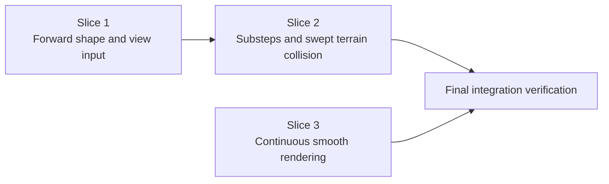

# Implementation Plan: Whip Motion and Rendering Polish

## References
- Specification: `SPEC.md`

## Progress
- [ ] Slice 1 — The whip opens forward and responds naturally to view motion
- [ ] Slice 2 — Fast chain motion remains stable against terrain
- [ ] Slice 3 — The rendered whip is continuous, tapered, and temporally smooth

## Current codebase state
- `feature/whip/paper/src/main/kotlin/plutoproject/feature/whip/paper/WhipChain.kt` implements a one-step Verlet/PBD chain with a hard point-zero anchor, straight view-direction initialization, four configurable constraint iterations, and endpoint overlap terrain resolution.
- The working tree contains an intentional uncommitted fix in `WhipChain.kt`: frame velocity now uses `current.clone().subtract(previous)` so rendering snapshots retain world positions. This fix must survive all simulation refactoring.
- `feature/whip/paper/src/main/kotlin/plutoproject/feature/whip/paper/WhipRenderer.kt` owns one normal world `BlockDisplay` per physical link. It teleports each Display to a midpoint with zero teleport duration while separately interpolating its transformation over two ticks.
- The native block model occupies local coordinates `0..1`; the current transformation scales it around that uncorrected origin, which can offset links and expose gaps.
- `WhipSessionManager.kt` samples the hand anchor and eye direction once per 50 ms loop, gates world access through the existing ownership-radius check, and passes the physical frame independently to renderer and combat.
- `WhipCombat.kt` already ignores frames without motion history and derives all hits, crack audio, and acceleration from physical snapshots. It must not consume smoothed visual points or internal substep peaks.
- Configuration is loaded from `module/whip/config.conf` into validated Kotlin data classes in `WhipConfig.kt`.
- `WhipCommand.kt` has unrelated user changes in the working tree. Do not edit or overwrite them.
- No automated Minecraft client/server harness is present for measuring rope appearance or live collision behavior. Validation must therefore use targeted compilation, resource processing, assembly, and static invariant review; these checks cannot directly prove perceived animation quality.

## Execution roadmap

## Slices

### Slice 1 — The whip opens forward and responds naturally to view motion
**Status:** Pending

**Outcome**
A deployed whip starts in a forward-drooping shape, follows yaw and bounded pitch through a compliant root, and converts rapid view changes into chain motion without treating discontinuous anchor movement as a strike.

**Scope**
- Extend `WhipSimulationConfig` and `module/whip/config.conf` with validated `guide-strength` and `max-guide-pitch` values.
- In `WhipSessionManager.kt`, derive the guide direction from full yaw and symmetrically clamped pitch before passing it to the chain. Keep hand-side anchor calculation and the existing region-ownership gate intact.
- Replace straight-line chain initialization with a deterministic, exact-length forward-drooping layout and identical current/Verlet-previous positions.
- Add a compliant first-free-point guide constraint while retaining point zero as the only hard hand anchor.
- Track the preceding anchor, derive a chain-length-relative discontinuity threshold, and reinitialize with a no-history frame after an exceptional jump.
- Preserve reset behavior for session start and region-ownership pauses, including combat's existing no-history handling.

**Implementation notes**
- Defaults are `guide-strength = 0.35` and `max-guide-pitch = 55.0` degrees. Validate strength in `0.0..1.0` and pitch in `0.0..89.0`, rejecting non-finite values.
- Apply the guide as a soft positional correction toward one rest length from point zero; do not hard-copy point one to the target.
- Apply the root guide coherently with distance constraints so neither solver silently erases the other.
- A reset must update both position arrays and anchor history and must leave every returned snapshot independent. Preserve `current.clone().subtract(previous)` when deriving velocity.
- Do not change combat configuration or compensate for the new motion by altering damage values.

**Validation**
- `./gradlew :feature:whip:paper:compileKotlin :feature:whip:paper:processResources` — proves the new configuration schema, direction calculation, simulation API, and resource defaults compile and package together; it cannot demonstrate perceived responsiveness without a running client.
- `git diff --check` — proves the slice introduces no whitespace errors.

**Dependencies**
- None.

### Slice 2 — Fast chain motion remains stable against terrain
**Status:** Pending

**Outcome**
Each server tick advances the chain through two anchor-interpolated physical steps, and fast-moving points resolve solid terrain along their path instead of only after ending inside a block.

**Scope**
- Refactor `WhipChain.step` to run exactly two internal substeps while returning one outer frame.
- Interpolate from the prior continuous hand anchor to the current hand anchor across the two substeps.
- Scale gravity and damping so their configured values retain per-server-tick meaning.
- Upgrade `TerrainCollision` from final-position overlap resolution to swept point collision against nearby solid block collision shapes.
- Interleave or repeat link constraints and contact restoration so collision corrections survive the final solver pass.
- Keep world queries bounded to each point's swept local bounds and retain liquid exclusion.
- Preserve outer-tick snapshots and velocities for `WhipCombat`; do not expose or settle internal substep acceleration peaks.

**Implementation notes**
- Use half-step force scaling appropriate to Verlet integration and a per-substep damping factor whose composition approximates the configured full-tick damping.
- The sweep radius remains `simulation.sweepThickness / 2.0`; do not add another collision-width setting.
- Resolve the earliest valid collision along the substep path before penetration fallback. Retain collision-shape handling for slabs and other non-full blocks.
- Full link capsules, rope wrapping, friction configuration, and dynamic-block special cases remain outside this slice.
- Continue operating only after the session's existing area-ownership check; do not add asynchronous chunk or block access.

**Validation**
- `./gradlew :feature:whip:paper:compileKotlin` — proves the substep solver and Paper collision-shape integration compile with the pinned API; it cannot prove tunneling behavior in a live world.
- `git diff --check` — proves the slice introduces no whitespace errors.

**Dependencies**
- Slice 1.

### Slice 3 — The rendered whip is continuous, tapered, and temporally smooth
**Status:** Pending

**Outcome**
Every rendered segment spans its intended portion of a bounded smoothed curve, neighboring links hide seams, thickness tapers toward the tip, and segment position and shape interpolate together without adding Display entities.

**Scope**
- Add a visual-trajectory derivation inside the rendering responsibility while leaving the simulation frame untouched.
- Smooth only internal points, preserve endpoints and point count, and cap movement relative to adjacent physical links.
- Reject or retract smoothing displacement when the candidate visual point overlaps solid terrain collision shapes.
- Correct the Display origin/transformation calculation for the native block model's `0..1` local bounds.
- Extend neighboring links by a small internal overlap and apply continuous root-to-tip thickness taper.
- Use matching two-tick position and transformation interpolation settings.
- Retain one Display per physical link, stable list reuse, normal world tracking, non-persistence, and dispatcher-routed idempotent cleanup.

**Implementation notes**
- Keep smoothing deterministic and allocation-conscious because it runs once per active whip per server tick.
- Terrain-aware smoothing executes under the session's already-established ownership gate. Query only collision shapes local to a candidate's bounded displacement.
- Calculate transformed model bounds or an equivalent world-space origin correction so link geometry is centered on its axis rather than merely teleporting the entity to a midpoint.
- Segment overlap must hide cracks without materially extending the root or free-end position; endpoint expansion should therefore be asymmetric at the two ends where needed.
- Use the existing vanilla dark-brown palette. Do not introduce packet APIs, client assets, a second renderer backend, or additional render samples.

**Validation**
- `./gradlew :feature:whip:paper:compileKotlin` — proves smoothing, collision-shape checks, Display transformation, and interpolation APIs compile together; it cannot visually assess seams or animation latency.
- `git diff --check` — proves the slice introduces no whitespace errors.

**Dependencies**
- None. It consumes the existing physical-point interface and can be implemented in parallel with Slices 1–2.

## Final verification
- `./gradlew shadowJar` — assembles the complete plugin and proves the polished whip integrates with runtime-module indexing and the rest of the project.
- `git diff --check` — verifies all task changes are free of whitespace errors.
- `git diff -- feature/whip/paper/src/main/kotlin/plutoproject/feature/whip/paper feature/whip/paper/src/main/resources/module/whip/config.conf` — review the complete affected-source diff to confirm the clone-before-subtract fix remains, `WhipCommand.kt` was not changed by this task, visual points never enter combat, Display count is unchanged, and all world access remains behind existing ownership rules.
- Confirm only `guide-strength` and `max-guide-pitch` were added to public configuration; fixed substep, interpolation, smoothing, overlap, and taper values remain internal constants as specified.
